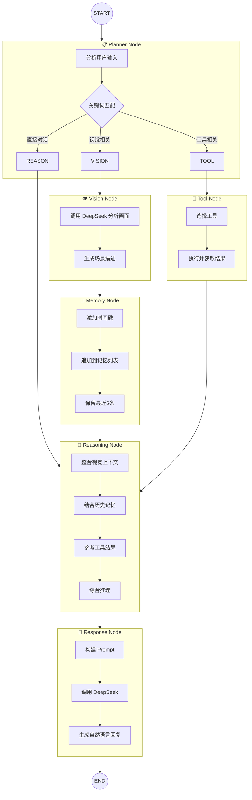

# 🔄 LangGraph StateGraph 流程图

## 完整状态图



## 路由决策矩阵

| 用户输入特征 | 路由路径 | 示例 |
|-------------|---------|------|
| 包含视觉关键词 | vision → memory → reasoning → response | "我手里拿的是什么？" |
| 包含工具关键词 | tool → reasoning → response | "搜索一下Python教程" |
| 普通对话 | reasoning → response | "你好，介绍一下自己" |
| 混合意图 | vision → memory → reasoning → response | "看到这个红色的水果是什么？" |

## 状态流转示例

```
用户输入: "我桌子上有什么？"

Step 1: planner_node
  输入: user_input="我桌子上有什么？"
  决策: vision（匹配"桌子"、"什么"视觉关键词）
  输出: _next_step="vision"

Step 2: vision_node
  输入: user_input="我桌子上有什么？"
  输出: vision_context="检测到桌面场景: 笔记本电脑(银色)、马克杯(白色)、..."
  
Step 3: memory_node
  输入: vision_context="检测到桌面场景..."
  输出: scene_memory=["[14:30:15] 检测到桌面场景..."]
  记忆: 保留最近5条场景记录

Step 4: reasoning_node
  输入: vision_context + scene_memory + user_input
  输出: 推理结论 → 整合视觉信息的回答方案

Step 5: response_node
  输入: 全部状态
  输出: final_response="你的桌子上有一台银色笔记本电脑、一个白色马克杯..."
```

## 关键设计决策

1. **条件路由** — planner_node 使用关键词匹配代替 LLM 调用，减少延迟和成本
2. **记忆窗口** — scene_memory 保留 5 条记录，平衡上下文长度和 Token 消耗
3. **容错设计** — 每个节点都有 try/except 保护，单节点失败不影响整体流程
4. **可扩展性** — 新节点通过 `graph.add_node()` 注册，通过条件边接入现有流程
