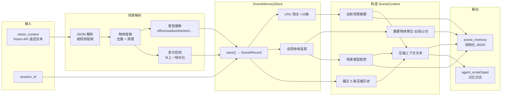
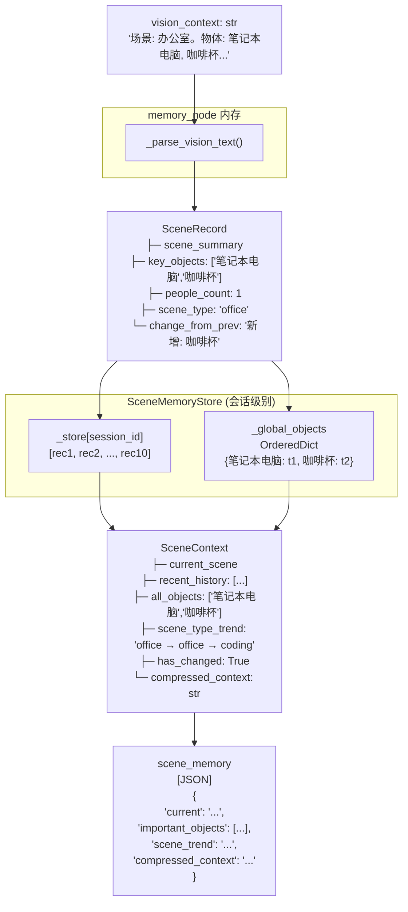

# 🧠 LangGraph Scene Memory Node — 流程图

## 完整 StateGraph

```mermaid
graph TB
    START((START)) --> planner_node

    planner_node{planner_node<br/>行为规划} -->|vision| vision_node
    planner_node -->|tool| tool_node
    planner_node -->|direct_reason| reasoning_node

    vision_node[👁️ vision_node<br/>视觉场景分析] --> memory_node

    subgraph memory["🧠 memory_node — 场景长期记忆"]
        direction TB
        M1[1️⃣ 接收 vision_context] --> M2[2️⃣ SceneMemoryStore.save<br/>解析场景 + 分类 + 提取物体]
        M2 --> M3[3️⃣ build_scene_context<br/>读取历史 + 压缩 + 聚合]
        M3 --> M4[4️⃣ 输出结构化 scene_memory]
        
        subgraph store["SceneMemoryStore"]
            S1["📦 LRU 队列 (10条)"]
            S2["🏷️ 物体追踪表"]
            S3["📊 场景类型趋势"]
        end
        
        M2 -.-> S1
        M2 -.-> S2
        M3 -.-> S3
    end

    memory_node --> reasoning_node
    tool_node[🔧 tool_node<br/>工具执行] --> reasoning_node

    reasoning_node[🧠 reasoning_node<br/>综合推理] --> response_node
    response_node[💬 response_node<br/>生成回复] --> END((END))

    style memory fill:#1e293b,stroke:#6366f1,stroke-width:3px,color:#e2e8f0
    style store fill:#0f172a,stroke:#06b6d4,stroke-width:2px,stroke-dasharray:5
```



## memory_node 内部流程



## 数据结构流转



## 示例：10 轮场景记忆演化

```mermaid
gantt
    title 场景记忆时间线 (最近10条)
    dateFormat HH:mm:ss
    axisFormat %H:%M:%S
    
    section 场景类型
    办公场景    :t1, 00:00, 8s
    办公场景    :t2, after t1, 8s
    办公场景    :t3, after t2, 8s
    办公场景    :t4, after t3, 2s
    编码场景    :t5, after t4, 4s
    编码场景    :t6, after t5, 8s
    编码场景    :t7, after t6, 8s
    编码场景    :t8, after t7, 8s
    办公场景    :t9, after t8, 3s
    办公场景    :t10, after t9, 8s
    
    section 重要物体
    laptop      :active, t1, t10
    cup         :active, t1, t5
    coffee      :active, t1, t3
    book        :active, t4, t8
    phone       :active, t9, t10
```
